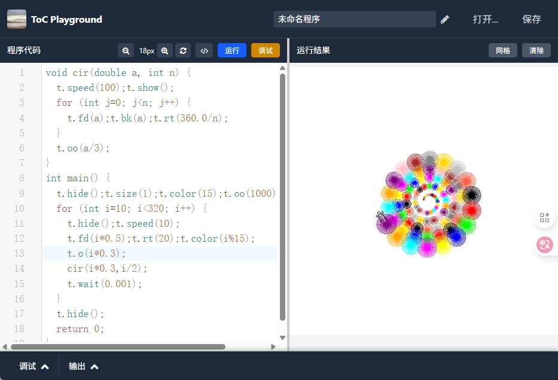

# ToC Playground - Online C Language Teaching Interpreter

[中文](./README.md) | [English](./readme_en.md)

[Online playground](http://toc.szzy.top "Online playground")


ToC Playground (Turtle on C) is an online interpreter and visual programming environment designed specifically for C language teaching. It allows students to learn C programming through a method similar to Python's Turtle library, intuitively understanding programming concepts through graphical visualization.




## Features

### 1. Drawing Functionality
- Provides drawing functionality similar to Python Turtle
- Supports various drawing commands: forward, backward, turn, draw shapes, etc.
- Visual programming to help students understand program execution flow

### 2. Online C Language Interpreter
- Supports standard C language syntax
- Real-time interpretation execution without compilation
- Provides error messages and debugging functionality

### 3. Interactive Learning Environment
- Code editor with syntax highlighting
- Real-time result display
- Visual turtle drawing area

## Drawing Commands

### Basic Movement Commands
- `pen.forward(distance)` or `pen.fd(distance)` - Move forward by specified distance
- `pen.back(distance)` or `pen.bk(distance)` - Move backward by specified distance
- `pen.right(angle)` or `pen.rt(angle)` - Turn right by specified angle
- `pen.left(angle)` or `pen.lt(angle)` - Turn left by specified angle
- `pen.turn(angle)` - Turn to specified angle

### Position Control Commands
- `pen.goto(x, y)` - Move to specified coordinates
- `pen.setHeading(angle)` - Set heading angle
- `pen.setRotationMode(mode)` - Set rotation mode

### Drawing Control Commands
- `pen.setColor(color)` or `pen.color(color)` - Set pen color
- `pen.clear()` - Clear canvas
- `pen.hide()` - Hide turtle icon
- `pen.show()` - Show turtle icon

### Shape Drawing Commands
- `pen.drawLine(x, y)` - Draw line to specified point
- `pen.drawRect(width, height)` - Draw rectangle
- `pen.fillRect(width, height)` - Draw filled rectangle
- `pen.drawCircle(radius)` - Draw circle
- `pen.fillCircle(radius)` - Draw filled circle
- `pen.ellipse(width, height)` - Draw ellipse
- `pen.fillEllipse(width, height)` - Draw filled ellipse
- `pen.drawText(text, font)` - Draw text
- `pen.fillText(text, font)` - Draw filled text

### Other Commands
- `pen.drawImage(path)` - Draw image
- `pen.wait(seconds)` - Wait for specified seconds

## Usage Example

```c
int main() {
    // Draw a square
    pen.setColor("#FF0000");  // Set red color
    for(int i = 0; i < 4; i++) {
        pen.forward(100);     // Move forward 100 pixels
        pen.right(90);        // Turn right 90 degrees
    }
    
    // Draw a filled circle
    pen.goto(200, 200);       // Move to position (200, 200)
    pen.setColor("#00FF00");  // Set green color
    pen.fillCircle(50);       // Draw filled circle with radius 50
    
    // Add text
    pen.goto(100, 300);
    pen.setColor("#0000FF");  // Set blue color
    pen.fillText("Hello ToC!", "20px Arial");
    
    return 0;
}
```

## Installation and Running

### Local Running
```bash
# Clone the project
git clone <repository-url>
cd toc
npm install
npm run dev
```

## Teaching Application Scenarios

### 1. Programming Introduction Teaching
- Help students understand basic syntax through visual drawing
- Visually demonstrate control structures like loops and conditionals
- Lower the barrier to learning programming

### 2. Algorithm Teaching
- Visually display algorithm execution process
- Help students understand algorithm concepts like recursion and sorting
- Demonstrate data structures through graphical methods

### 3. Mathematics Teaching
- Draw geometric shapes to help understand mathematical concepts
- Visualize function graphs
- Display mathematical rules and patterns

## Contributing

Issues and Pull Requests are welcome to improve ToC Playground. If you have good ideas or found bugs, please let us know!

## License

This project is licensed under the MIT License. See the LICENSE file for details.

## Contact

If you have questions or suggestions, please contact the project maintainers or submit an Issue on GitHub.